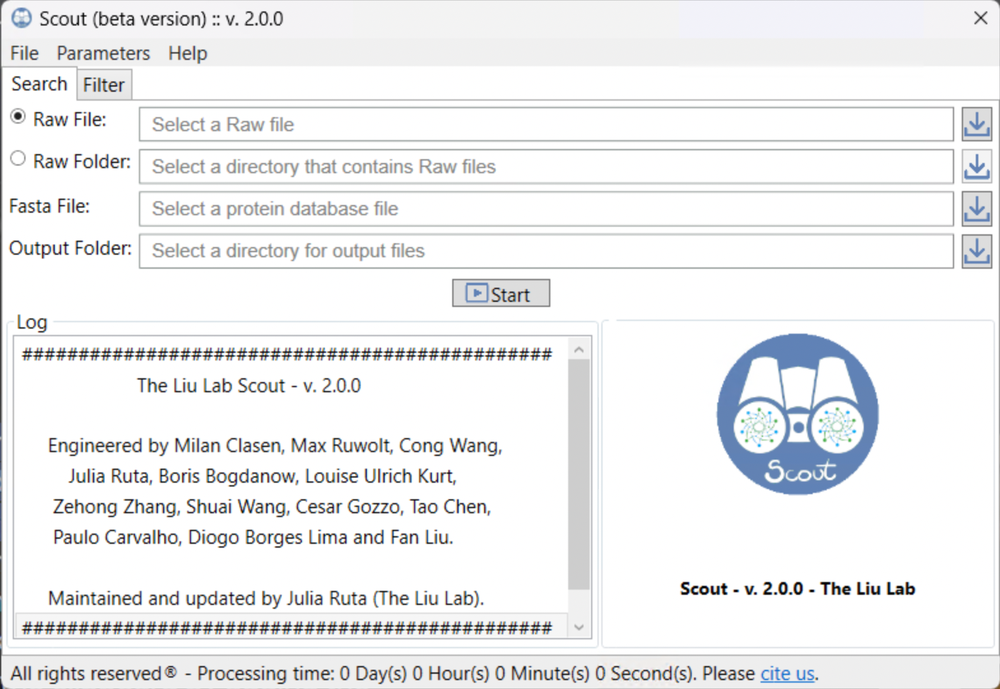
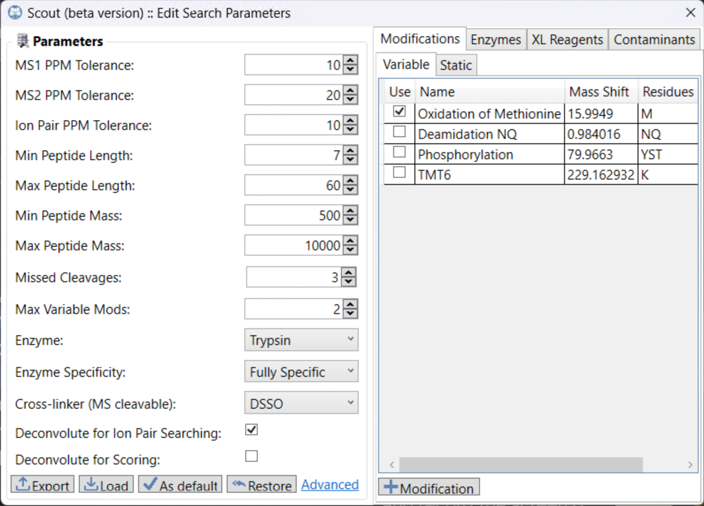
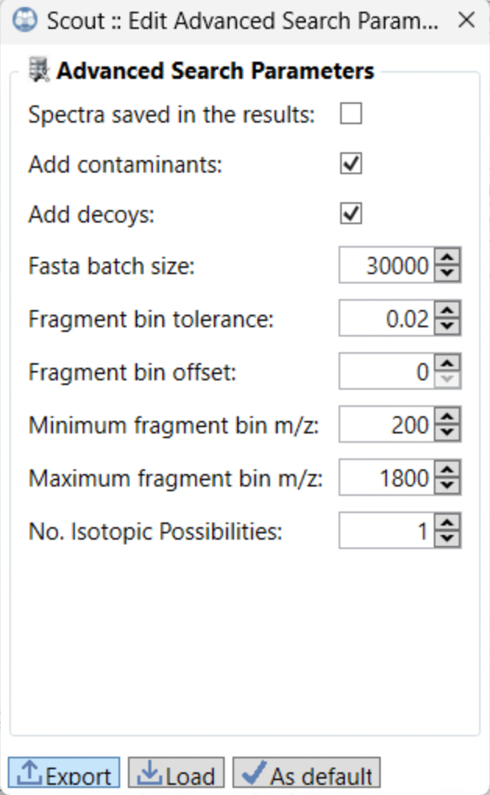
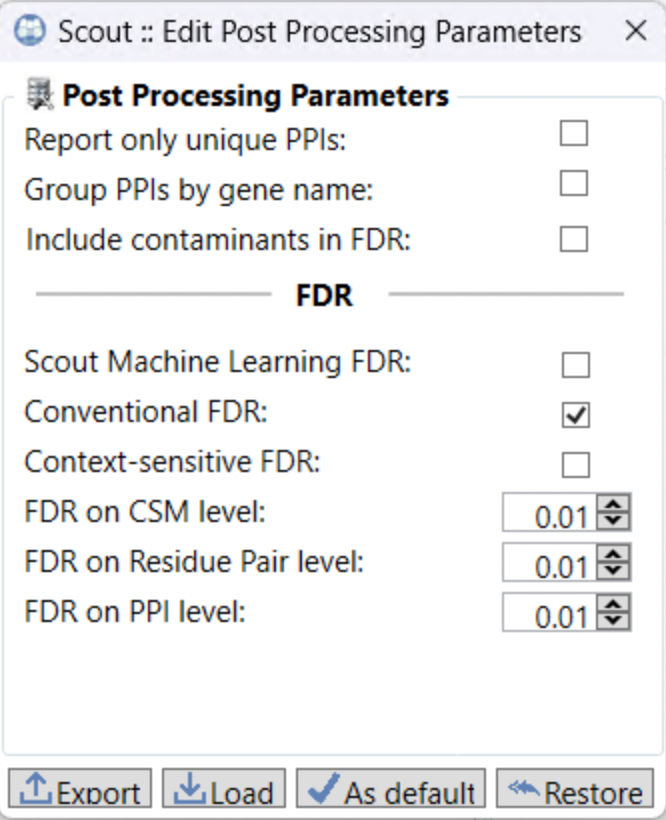
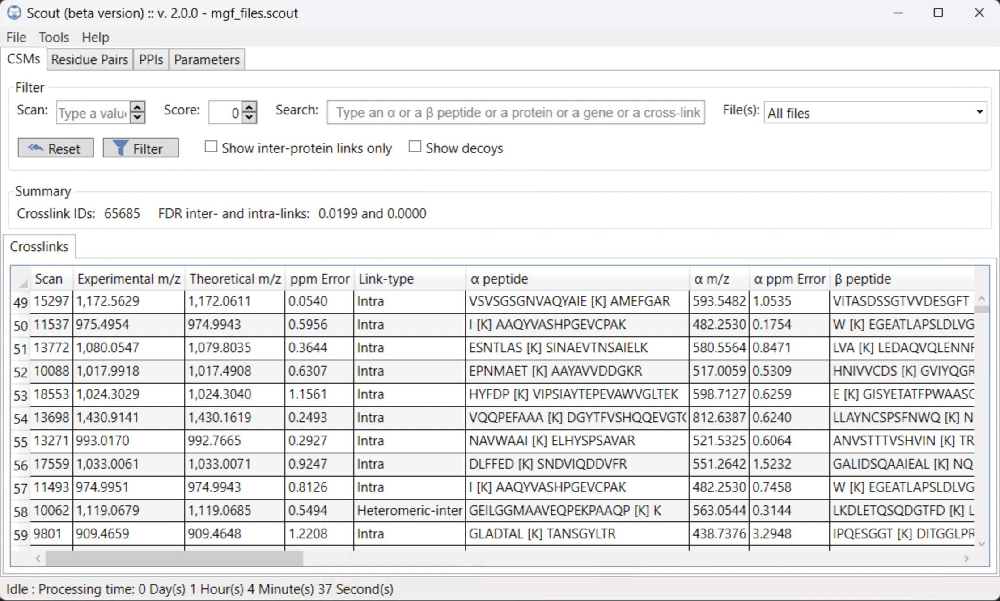
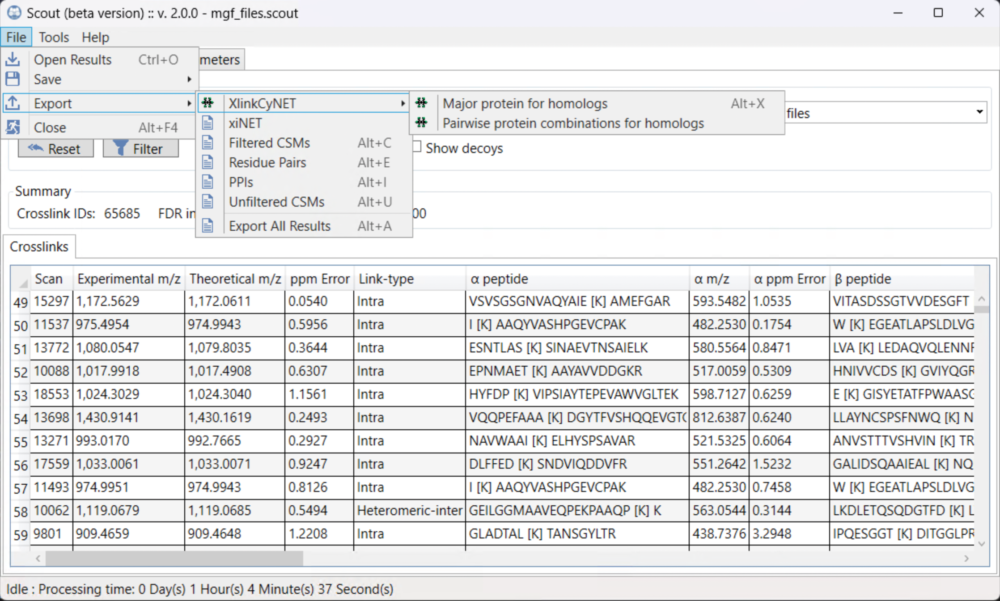
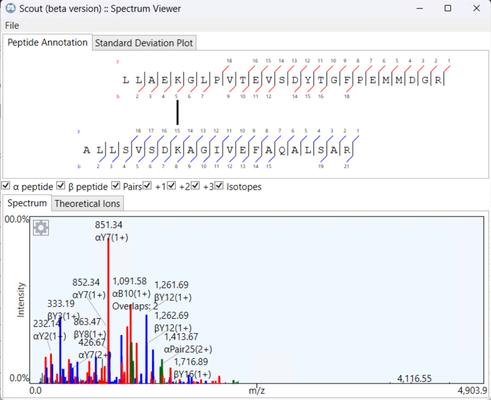
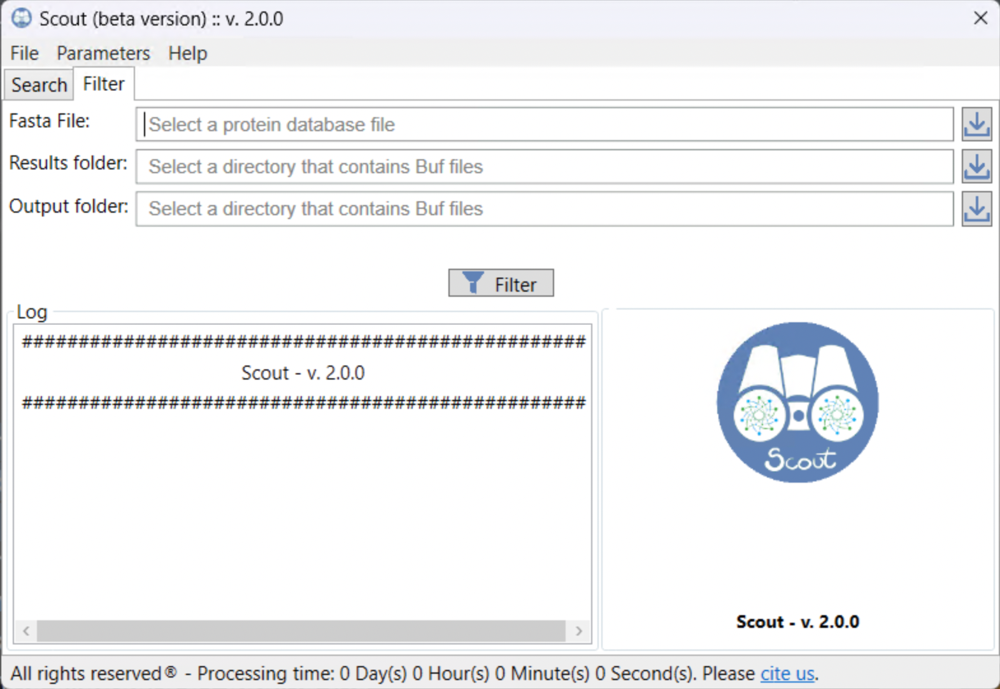

# Scout - The Liu Lab

Welcome to the Liu Lab’s version of **_Scout_**, a powerful tool for analyzing mass spectrometry data generated from cleavable cross-linking reagents.  

With the release of **_Scout_ v2.0.0** (Beta), we introduce important bug fixes along with new strategies for handling False Discovery Rates (FDR). Building on the machine-learning–based FDR approach first introduced in _Scout v1.5.1_, we now provide two additional modes for FDR estimation:

1. **Conventional FDR** – calculated solely based on the Poisson Score obtained from spectrum matches.  
2. **Context-sensitive FDR** – accounts for the number of crosslinks supporting a heteromeric protein–protein interaction (PPI) at the residue-pair level, as described in [Bogdanow *et al.*](https://www.embopress.org/doi/full/10.1038/s44320-024-00079-w) [<a href="#lib_7">7</a>].

Disclaimer: Writing the manuscript describing the new features is currently in progress. The source code and final release version will be made available upon publication.

# Equipment
## Hardware
- A computer with a minimum of 16 GB RAM and 4 computing cores is recommended. However, the software can take advantage of superior configurations.

## Software
-	Windows 10 (64 bits) or later.
-	Python 3.10 or later.
-	.NET Core 6 or later.
-	_Scout_, available for download at https://github.com/theliulab/Scout/releases.

## Data files
### Input
_Scout_ is compatible with data files in the formats MS2, Mascot Generic Format (MGF), Bruker® d files, and Thermo® RAW files.
### Output
_Scout_ saves results in _*.scout_ format, in [mzIdentML 1.2](http://www.psidev.info/mzidentml#mzid12) and [mzIdentML 1.3](http://www.psidev.info/mzidentml#mzid13) proposed by [HUPO Proteomics Standard Initiative](http://www.psidev.info/) to support the identification of cross-linked peptides. This enables complete submission of XL-MS data to PRIDE [<a href="#lib_1">1</a>], and thus, is compatible with the PRIDE Inspector software [<a href="#lib_2">2</a>]. Additionally, _Scout_ supports the export of unfiltered as well as FDR filtered CSMs, FDR filtered Residue Pairs and FDR filtered PPIs as CSV files. Results can also be transformed to the [XlinkCyNET](https://apps.cytoscape.org/apps/xlinkcynet) [<a href="#lib_3">3</a>] format for visualization within [Cytoscape](https://cytoscape.org/) [<a href="#lib_4">4</a>] as well as **xiNET** [<a href="#lib_5">5</a>] format.

# FDR control
_Scout_ provides flexible options for FDR control. You can either export the identified, unfiltered CSMs for custom FDR processing using the many scores Scout provides or choose from three built-in FDR modes.

_Scout_ offers a **dependent** FDR, ensuring that only CSMs passing the FDR threshold contribute to Residue Pair aggregation, and only Residue Pairs meeting the threshold proceed to PPI aggregation. 

## Conventional FDR
Intra- and inter-links are treated separately. Additionally, Scout assigns and processes homomeric inter-links, which represent cross-links between identical peptides in two distinct sequences. These cross-links indicate a homo-oligomeric PPI.

For intra- and homomeric inter-links, we apply the standard FDR approach using the Poisson Score for filtering, based on the formula:

$$
FDR = \frac{DD}{TT}
$$

Inter-links, however, are filtered separately at each level (CSM, Residue Pair, PPI) using the following formula:

$$
FDR = \frac{TD-DD}{TT}
$$

where:

- $TD$ represents target-decoy identifications
- $DD$ represents decoy-decoy identifications
- $TT$ represents target-target identifications

This calculation takes into account the cross-linked alpha and beta assignments [<a href ="#lib_6">6</a>].

## Context-sensitive FDR

In a previous study [<a href ="#lib_7">7</a>], we introduced the concept of **context-sensitive** FDR, which enhances inter-link identifications while reducing false positives. This method is particularly effective for highly complex biological samples.

In this approach, intra- and homomeric inter-links are treated separately and follow the standard error estimation process, as described for [Conventional FDR](#conventional-fdr) across all levels. Initially, a high CSM FDR threshold is applied (10%). CSMs are then aggregated into Residue Pairs.

Inter-link Residue Pairs are categorized based on their contextual information, independent of whether they originate from target or decoy identifications. These categories are:

- **Context-rich**: A PPI where both the alpha and beta proteins have at least two unique linked residues.
- **Context-poor**: A PPI where at least one of the alpha or beta proteins has only a single unique linked residue.

For each category, a Gaussian density function is applied to the Poisson Scores to generate separate interpolated functions for target and decoy identifications. Given the differences in score distributions between targets and decoys, these functions allow the assignment of Posterior Error Probabilities (PEP) to each Residue Pair.

Once PEP scores are assigned, the context-rich and context-poor groups are combined and subjected to error control using the inter-link [Conventional FDR](#conventional-fdr) method, now based on the newly established PEP scores.

## Classification FDR
The classification FDR method employs a classifier trained on our ground truth dataset [<a href ="#lib_8">8</a>]. Each identification is assigned a classification score, which is then used to estimate the error rate using the standard target-decoy approach.

For intra- and homomeric inter-links, the error rate is calculated jointly, whereas inter-links are processed separately, following the approach described above.  

# Procedures

## Software installation
1. Download _Scout_ by clicking on <i>Scout_setup_64bit.msi</i> in the [latest release](https://github.com/theliulab/Scout/releases/).
2. Install by double-clicking.

## How to use _Scout_

  
 
  <b>Graphical User Interface of Scout’s main window.</b>

  
**Initial Setup**

1. Search separate file(s): Check the ‘Raw File(s)’ button on the left, then select at least one tandem mass spectra file (e.g. MS2, MGF or Thermo® RAW).  
2. Search a batch of files: Check the ‘Raw folder’ button, then specify a directory containing multiple tandem mass spectra files.
3. Fasta File: Select a database file containing protein sequences. The file format must be in FASTA format, typically obtained from <a href="https://www.uniprot.org/">Uniprot</a> and should be free of decoys as well as contaminants. By default, _Scout_ will add both. This can be edited in the [Advanced Search Parameters](#advanced-search-parameters).
4. Adjust [Search Parameters](#search-parameters): Search parameters can and should be adjusted in dependence of your sample and crosslinker reagent. For this, go to **Parameters &#8594; Search**.
5. Adjust [Post Processing Parameters](#post-processing-parameters): Here, you can choose your preferred algorithm for FDR control as well as the percentage thresholds on CSM, Residue Pair and PPI level. Additionally, you are able to choose whether you want to include contaminants in the FDR. **Parameters &#8594; Post Processing**
6. Click 'Start' to initiate the search. If you chose none, the search will run in default mode. Once the search is complete, a results window will open. To stop the search, click 'Cancel' and confirm.
PS: If _Scout_ closes during a run, the search can be continued. Just set the same parameters again and press 'Start'.
7. Progress will be recorded in the logbox. To export it, go to **File &#8594; Export log** (or press ALT + M).

### Search Parameters
Search parameters should be adapted to your sample and respective crosslinking reagent. In general, we recommend a minimum peptide length of 7. 
In case a specific modification cannot be found in _Scout_ yet, you are able to add it manually under **Modification**. Hereby needs to be specified, that N-terminal modifications occur on peptide, not protein level.
Additionally, you are able to adapt the enzyme, cross-linking reagents (XL Reagents) as well as contaminants. By default, _Scout_ will use the same contaminants as the Cambridge Centre for Proteomics [cRAP] (https://cambridgecentreforproteomics.github.io/camprotR/articles/crap.html).
  
 
  <b>Search Parameters.</b>

  
#### Advanced Search Parameters
Advanced search parameters allow you to disable the automatic incorporation of reverse decoys and contaminants in your database.
  
 
  <b>Advanced Search Parameters.</b>

### Post Processing Parameters

Adjusting post processing parameters allows you to select a specific FDR method as well as the applied FDR thresholds on CSM, Residue Pair and PPI level.  

   
  <b>Post Processing Parameters</b>

_Scout_ handles **intra-** and **inter-crosslinks** separately. You can also decide whether to include contaminants in the FDR calculation. If enabled, contaminants will also appear in the results.

Under the **FDR** section, you can choose from three mutually exclusive modes:

1. **Machine learning–based (Scout v1.5.1)**  
   Uses a classifier fine-tuned on a ground-truth dataset.  
2. **Conventional Poisson-based FDR**  
   Applies a Poisson Score based FDR control based on a concatenated target-decoy database.  
3. **Context-sensitive FDR**  
   Increases sensitivity at the Residue Pair level by incorporating supporting crosslinks as well as a fused target-decoy approach.

All modes use a **dependent FDR strategy**, meaning only identifications that pass the threshold at a lower level (e.g., CSM) are aggregated to a higher level (e.g., Residue Pair). For context-sensitive FDR, an optimized **CSM threshold of 10%** is applied automatically.

## Results
Search results are either saved in the same directory as the RAW files or a chosen output folder, and will be visualized in a new window with separate tabs: CSMs, Residue Pairs and PPIs, as well as the parameters used during the search and post processing steps. 
  
 
  <b>Results viewer.</b>

In order to export your results, go to **File &#8594; Export**.
You can export the following:
- Unfiltered CSMs: all identifications and decoys without FDR filtering.
- Filtered CSMs: all CSMs that passed the CSM FDR.
- Residue Pairs: all Residue Pairs that passed the Residue Pair FDR.
- PPIs: all PPIs that passed the PPI FDR.
- XlinkCyNet: all PPIs that passed the PPI FDR and their corresponding Residue Pairs prepared in the format needed for Cytoscape and XlinkCyNet visualization. In case of identifications with protein groups, you can either export the major protein, here the protein with the longest sequence, or all possible pairwise combinations. Both tables will be based on the PPI table.
- xiNET: all PPIs and their corresponding Residue Pairs prepared in xiNET format for visualization. The output is based on the PPI table.
- Export All Results: automatically export xiNET, XlinkCyNet, Search and Post Processing Parameters as well as FDR filtered CSMs, Residue Pairs and PPIs to a chosen directory. 

Filtered CSMs, Residue Pairs and PPIs will be exported as displayed in the GUI. E.g. if you disabled decoys, they will not be exported. In order to export decoy identifications in your FDR filtered results, tick the "Decoys" box.  

  
 
  <b>File export.</b>

Double-clicking a row containing a CSM opens a spectrum viewer, displaying the annotated spectrum from which the cross-link was identified. 
  
 
  <b>Spectrum viewer.</b>

## Re-filter results
_Scout_ results can also be re-filtered with a different FDR without the need of researching the spectra (only possible if .buf and .scout files exist). Select the original FASTA as well as the directory containing the .buf and .scout files. Defining an output folder is optional, if none is given, files will be saved under the .buf folder path.
  
 
  <b>Graphical User Interface of Scout’s Filtering window.</b>

# Closing Remarks

The original Scout version published in Nature Methods in 2024 can be found here: [1.5.1](https://github.com/diogobor/Scout/releases/tag/1.5.1) 
Releases beyond version 1.5.1, uploaded on [this GitHub](https://github.com/diogobor/Scout), are independent, and as such **not supported** by our lab.
_Scout_ updates, developed by the Liu Lab, will be uploaded here in this repository.

If you have questions, feedback, or ideas for improving _Scout_, please reach out to me at [ruta@fmp-berlin.de](mailto:ruta@fmp-berlin.de).

_<b>Please cite our paper:</b>_ 
_Clasen, MA, et al., [“Proteome-scale recombinant standards and a robust high-speed search engine to advance cross-linking MS-based interactomics”](https://doi.org/10.1038/s41592-024-02478-1), Nature Methods, 2024._

# References

[1]	J. A. Vizcaíno et al., “The PRoteomics IDEntifications (PRIDE) database and associated tools: status in 2013,” Nucleic Acids Res., vol. 41, no. Database issue, pp. D1063-1069, Jan. 2013, doi: <a href="https://doi.org/10.1093/nar/gks1262" target="_blank">10.1093/nar/gks1262</a>.

[2]	Y. Perez-Riverol et al., “PRIDE Inspector Toolsuite: Moving Toward a Universal Visualization Tool for Proteomics Data Standard Formats and Quality Assessment of ProteomeXchange Datasets,” Mol. Cell Proteomics, vol. 15, no. 1, pp. 305–317, Jan. 2016, doi: <a href="https://doi.org/10.1074/mcp.O115.050229" target="_blank">10.1074/mcp.O115.050229</a>.

[3]	D. B. Lima, Y. Zhu, and F. Liu, “XlinkCyNET: A Cytoscape Application for Visualization of Protein Interaction Networks Based on Cross-Linking Mass Spectrometry Identifications,” J. Proteome Res., vol. 20, no. 4, pp. 1943–1950, Apr. 2021, doi: <a href="https://doi.org/10.1021/acs.jproteome.0c00957" target="_blank">10.1021/acs.jproteome.0c00957</a>.

[4] Combe, Colin W et al. “xiNET: cross-link network maps with residue resolution.” Molecular & cellular proteomics : MCP vol. 14,4 (2015): 1137-47. doi:<a href="https://doi.org/10.1074/mcp.O114.042259" target="_blank">10.1074/mcp.O114.042259</a>.

[5]	P. Shannon et al., “Cytoscape: A Software Environment for Integrated Models of Biomolecular Interaction Networks,” Genome Res., vol. 13, no. 11, pp. 2498–2504, Nov. 2003, doi: <a href="https://doi.org/10.1101/gr.1239303" target="_blank">10.1101/gr.1239303</a>.

[6] Fischer, Lutz, and Juri Rappsilber. "Quirks of error estimation in cross-linking/mass spectrometry." Analytical chemistry 89.7 (2017): 3829-3833. doi: <a href="https://doi.org/10.1021/acs.analchem.6b03745" target="_blank">10.1021/acs.analchem.6b03745</a>.

[7]	Bogdanow, Boris, et al. "Redesigning error control in cross-linking mass spectrometry enables more robust and sensitive protein-protein interaction studies." Molecular Systems Biology

# Troubleshooting
Below are some common issues you may encounter and suggested fixes.  
If your issue is not listed here, please open a **GitHub Issue** with details about your setup.

---

**Problem:** _Scout_ gets stuck during `Checking Python...` and crashes without error  
**Cause:** _Scout_ encounters problems while checking your Python installation OR multiple/obsolete Python versions may be registered in the Windows Registry, causing conflicts. 
**Solution:**  
1. Open the Registry Editor (`regedit`).
2. Navigate to:
   - `HKEY_LOCAL_MACHINE\SOFTWARE\Python`
3. Check for entries pointing to old or non-existent Python installations.
4. Remove obsolete entries (be careful not to delete active versions).
- As a workaround, you can install [Anaconda](https://www.anaconda.com/) and create a dedicated virtual Python environment.
P.S.: Editing the Windows Registry can affect your system stability. Only remove entries if you’re sure they are obsolete. 
If unsure, back up your Registry first (`File > Export` in Regedit).

---

**Problem:** `ERROR: It's not possible to set up Python. ERROR: Could not update pip.`  
**Cause:** Your user account does not have sufficient permissions to update or install Python.  
**Solution:**  
- Start _Scout_ once with **Administrator privileges** (or use another user account with installation permissions).  
- This allows _Scout_ to update pip and modify the system PATH variables if necessary.
